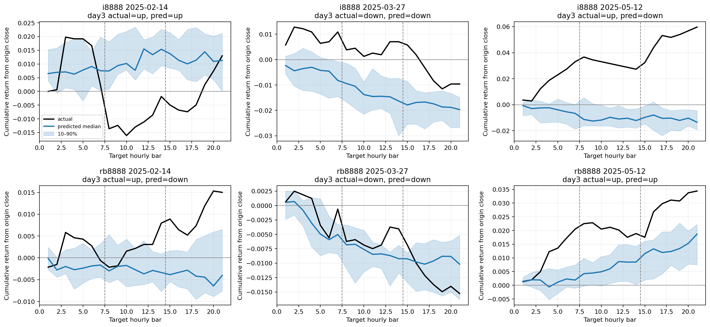

# V2 Phase 1：三交易日 Zero-shot 与数据基线

本报告覆盖预先锁定的全部完整 walk-forward folds。

本阶段是已观察历史上的 expanding walk-forward 开发比较，不是新的封存测试。
所有路径方向指标均由完整生成路径的 sampled median path 推导；第三日末方向是主指标。

## Pooled 三日端点指标

| Model | Cases | Day1 bal. acc. | Day2 bal. acc. | Day3 bal. acc. | Day3 return MAE |
|---|---:|---:|---:|---:|---:|
| zero_shot | 116 | 56.95% | 61.61% | 71.05% | 0.017119 |
| majority | 116 | 53.90% | 51.27% | 56.26% | 0.017367 |
| momentum | 116 | 44.66% | 45.11% | 46.73% | 0.034207 |
| persistence | 116 | 0.00% | 0.00% | 0.00% | 0.017367 |

## Zero-shot 分合约第三日指标

| Instrument | Cases | Day3 bal. acc. | Day3 accuracy | Return MAE | Return corr. |
|---|---:|---:|---:|---:|---:|
| i8888 | 58 | 68.10% | 68.97% | 0.024201 | 0.2255 |
| rb8888 | 58 | 75.66% | 75.86% | 0.010038 | 0.5452 |

## Zero-shot 路径与生成审计

- Mean return-path correlation: `0.2055`
- Mean z-normalized DTW: `0.540661`
- Mean return-space DTW: `0.008493`
- Mean slope-sign agreement: `47.32%`
- Raw non-finite value rate: `0.00%`
- Raw OHLC violation rate: `4.75%`
- Raw negative volume/amount rate: `0.00%`

## Zero-shot 逐 fold 稳定性

| Fold | Cases | Day3 bal. acc. | Return-path corr. | Z-normalized DTW |
|---|---:|---:|---:|---:|
| fold_00 | 116 | 71.05% | 0.2055 | 0.540661 |

## 运行信息

- Elapsed seconds: `20.42`
- 原始及 OHLC/非负流量修复后的逐 sample 路径均保存在对应 run 目录。
- 报告没有把均值曲线当作唯一输出；主指标固定使用 sampled median path。
- 15/17 根组合在当前清洗后真实历史中未出现；构造性单元测试仍覆盖全部 5/7 三日组合。

完整机器可读指标：`phase1_pilot_cuda_metrics.json`。
