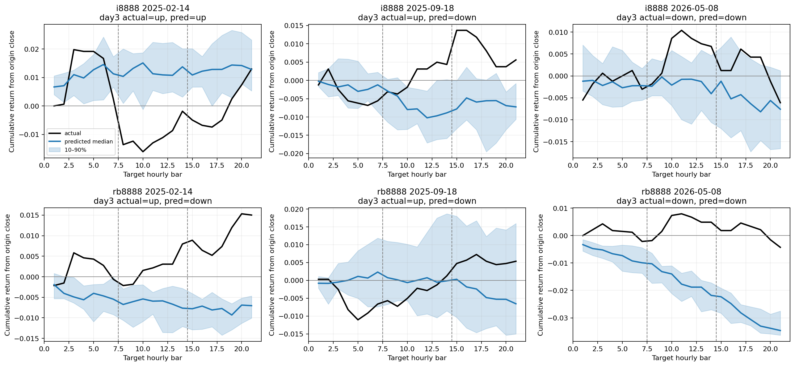

# V2 Phase 1：三交易日 Zero-shot 与数据基线

本报告覆盖预先锁定的全部完整 walk-forward folds。

本阶段是已观察历史上的 expanding walk-forward 开发比较，不是新的封存测试。
所有路径方向指标均由完整生成路径的 sampled median path 推导；第三日末方向是主指标。

## Pooled 三日端点指标

| Model | Cases | Day1 bal. acc. | Day2 bal. acc. | Day3 bal. acc. | Day3 return MAE |
|---|---:|---:|---:|---:|---:|
| zero_shot | 580 | 50.96% | 50.49% | 53.87% | 0.016966 |
| majority | 580 | 50.07% | 51.92% | 52.31% | 0.013358 |
| momentum | 580 | 47.91% | 47.51% | 49.99% | 0.026325 |
| persistence | 580 | 0.00% | 0.00% | 0.00% | 0.013358 |

## Zero-shot 分合约第三日指标

| Instrument | Cases | Day3 bal. acc. | Day3 accuracy | Return MAE | Return corr. |
|---|---:|---:|---:|---:|---:|
| i8888 | 290 | 56.39% | 54.42% | 0.020645 | 0.0309 |
| rb8888 | 290 | 51.41% | 51.21% | 0.013288 | 0.0569 |

## Zero-shot 路径与生成审计

- Mean return-path correlation: `0.0005`
- Mean z-normalized DTW: `0.659978`
- Mean return-space DTW: `0.008670`
- Mean slope-sign agreement: `45.63%`
- Raw non-finite value rate: `0.00%`
- Raw OHLC violation rate: `3.87%`
- Raw negative volume/amount rate: `0.00%`

## Zero-shot 逐 fold 稳定性

| Fold | Cases | Day3 bal. acc. | Return-path corr. | Z-normalized DTW |
|---|---:|---:|---:|---:|
| fold_00 | 116 | 68.15% | 0.1745 | 0.562811 |
| fold_01 | 116 | 51.76% | -0.0647 | 0.722702 |
| fold_02 | 116 | 48.03% | -0.0477 | 0.652257 |
| fold_03 | 116 | 55.70% | -0.0161 | 0.638331 |
| fold_04 | 116 | 50.36% | -0.0436 | 0.723788 |

## 运行信息

- Elapsed seconds: `2545.58`
- 原始及 OHLC/非负流量修复后的逐 sample 路径均保存在对应 run 目录。
- 报告没有把均值曲线当作唯一输出；主指标固定使用 sampled median path。
- 15/17 根组合在当前清洗后真实历史中未出现；构造性单元测试仍覆盖全部 5/7 三日组合。

完整机器可读指标：`phase1_metrics.json`。
