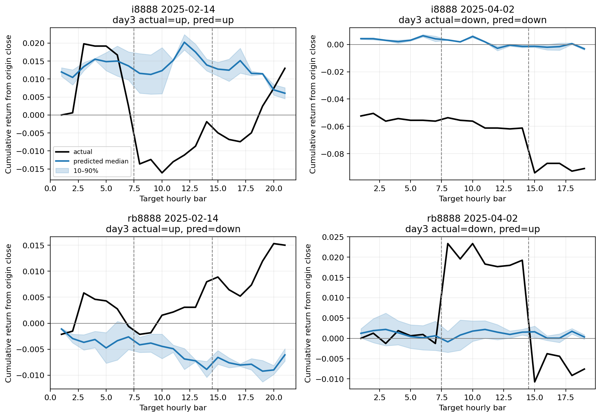

# V2 Phase 1 Smoke：三交易日 Zero-shot 与数据基线

本报告仅验证 4 个 smoke 案例，不能用于判断预测效果。

本阶段是已观察历史上的 expanding walk-forward 开发比较，不是新的封存测试。
所有路径方向指标均由完整生成路径的 sampled median path 推导；第三日末方向是主指标。

## Pooled 三日端点指标

| Model | Cases | Day1 bal. acc. | Day2 bal. acc. | Day3 bal. acc. | Day3 return MAE |
|---|---:|---:|---:|---:|---:|
| zero_shot | 4 | 66.67% | 50.00% | 50.00% | 0.030908 |
| majority | 4 | 83.33% | 0.00% | 50.00% | 0.031621 |
| momentum | 4 | 16.67% | 50.00% | 0.00% | 0.075303 |
| persistence | 4 | 0.00% | 0.00% | 0.00% | 0.031621 |

## Zero-shot 分合约第三日指标

| Instrument | Cases | Day3 bal. acc. | Day3 accuracy | Return MAE | Return corr. |
|---|---:|---:|---:|---:|---:|
| i8888 | 2 | 100.00% | 100.00% | 0.047306 | 1.0000 |
| rb8888 | 2 | 0.00% | 0.00% | 0.014509 | -1.0000 |

## Zero-shot 路径与生成审计

- Mean return-path correlation: `-0.0356`
- Mean z-normalized DTW: `0.548963`
- Mean return-space DTW: `0.022615`
- Mean slope-sign agreement: `32.64%`
- Raw non-finite value rate: `0.00%`
- Raw OHLC violation rate: `3.16%`
- Raw negative volume/amount rate: `0.00%`

## Zero-shot 逐 fold 稳定性

| Fold | Cases | Day3 bal. acc. | Return-path corr. | Z-normalized DTW |
|---|---:|---:|---:|---:|
| fold_00 | 4 | 50.00% | -0.0356 | 0.548963 |

## 运行信息

- Elapsed seconds: `3.47`
- 原始及 OHLC/非负流量修复后的逐 sample 路径均保存在对应 run 目录。
- 报告没有把均值曲线当作唯一输出；主指标固定使用 sampled median path。
- 15/17 根组合在当前清洗后真实历史中未出现；构造性单元测试仍覆盖全部 5/7 三日组合。

完整机器可读指标：`phase1_smoke_mps_metrics.json`。
