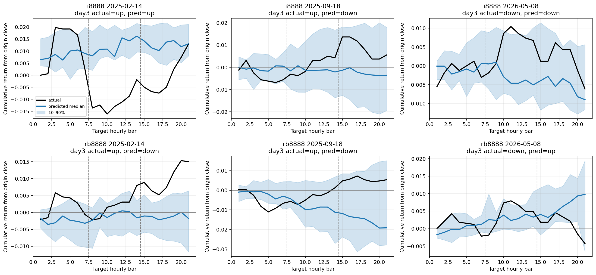

# V2 Phase 3：方向辅助损失消融

本阶段固定 `lambda_dir=0.2`、seed 42；checkpoint 仍由完整生成路径的第三日指标选择。
方向头指标与生成路径指标分开报告，方向头本身变好不等于 K 线路径方向变好。

## Pooled 生成路径对照

| Model | Cases | Day1 bal. acc. | Day2 bal. acc. | Day3 bal. acc. | Day3 return MAE | Return-path corr. | Z-DTW |
|---|---:|---:|---:|---:|---:|---:|---:|
| ce_direction | 580 | 51.08% | 49.73% | 54.04% | 0.016630 | -0.0068 | 0.659670 |
| phase2_ce_only | 580 | 50.37% | 50.99% | 54.56% | 0.016345 | 0.0045 | 0.652220 |
| zero_shot | 580 | 53.26% | 52.75% | 56.09% | 0.016673 | 0.0258 | 0.656709 |

## 辅助方向头（非主结果）

| Scope | Cases | Day1 aux bal. acc. | Day2 aux bal. acc. | Day3 aux bal. acc. | Day3 BCE |
|---|---:|---:|---:|---:|---:|
| pooled | 580 | 46.39% | 47.68% | 52.66% | 0.696540 |
| i8888 | 290 | 45.53% | 46.13% | 57.02% | 0.691403 |
| rb8888 | 290 | 47.05% | 48.93% | 48.40% | 0.701571 |

## 分合约第三日生成路径

| Instrument | CE + direction | Phase 2 CE-only | Zero-shot |
|---|---:|---:|---:|
| i8888 | 57.07% | 55.89% | 59.07% |
| rb8888 | 50.53% | 52.62% | 53.17% |

## 配对 moving-block bootstrap（day3 generated-path direction）

| Comparison | Block days | Point estimate | 95% CI | P(improvement > 0) |
|---|---:|---:|---:|---:|
| vs_phase2_ce_only | 5 | -0.52% | [-2.84%, 1.89%] | 33.25% |
| vs_phase2_ce_only | 10 | -0.52% | [-3.25%, 2.02%] | 36.10% |
| vs_zero_shot | 5 | -2.04% | [-5.63%, 1.65%] | 13.75% |
| vs_zero_shot | 10 | -2.04% | [-5.78%, 1.47%] | 13.45% |

## 逐 fold 路径方向变化

| Fold | CE + direction | Phase 2 CE-only | Zero-shot | Δ vs Phase 2 | Δ vs zero-shot |
|---|---:|---:|---:|---:|---:|
| fold_00 | 64.08% | 63.74% | 71.05% | 0.34% | -6.97% |
| fold_01 | 53.43% | 52.69% | 54.26% | 0.74% | -0.83% |
| fold_02 | 55.76% | 51.42% | 49.69% | 4.34% | 6.07% |
| fold_03 | 42.21% | 51.86% | 55.17% | -9.65% | -12.96% |
| fold_04 | 55.80% | 53.99% | 54.71% | 1.81% | 1.09% |

## 运行信息

- Elapsed seconds: `113.22`
- 只有生成路径的第三日方向、路径相关性和 DTW 同时改善，才可考虑后续 lambda 或多 seed。
- 结果仍是已观察历史上的 walk-forward 开发证据；不得作为独立前瞻或可交易结论。

完整机器可读指标：`phase3_cuda_metrics.json`。
