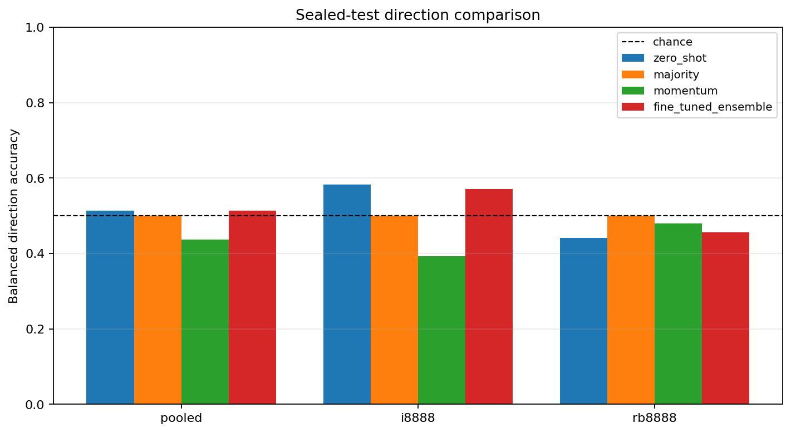
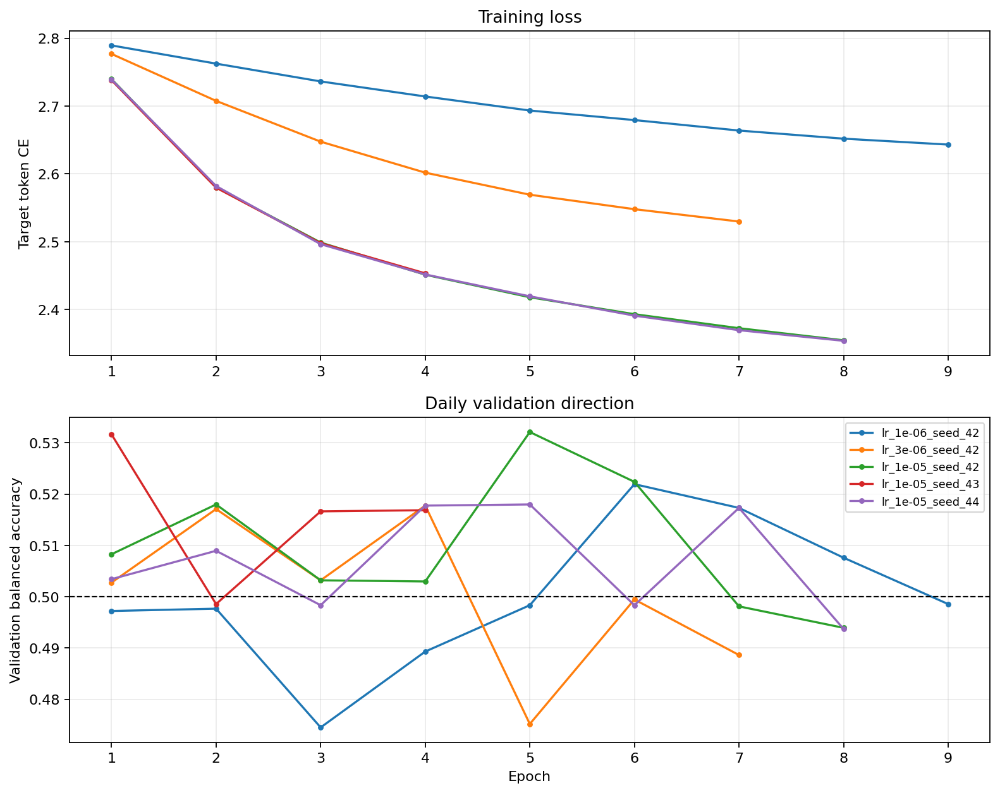
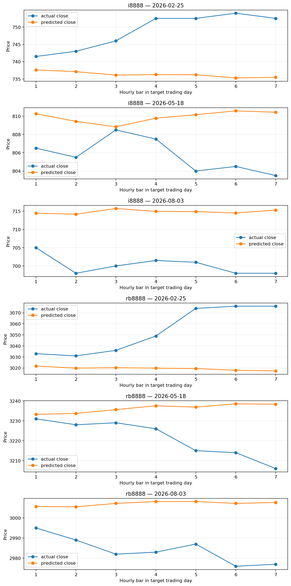

# Kronos 小时期货微调实验报告

## 结论

未证明有效：封存测试集上的点估计没有优于最强基线。

本报告衡量的是连续合约历史序列上的预测 edge，不是可执行合约的真实 PnL 回测。

## 数据审计

- rb8888: 4999 → 4988 bars; removed days: [{"trading_day": "2023-08-11", "bars": 4}, {"trading_day": "2024-04-04", "bars": 1}, {"trading_day": "2024-04-30", "bars": 6}]
- i8888: 4999 → 4993 bars; removed days: [{"trading_day": "2024-04-30", "bars": 6}]

时间切分：`2023-08-11` 至 `2026-08-03`；训练截止 `2025-09-08`，验证截止 `2026-02-24`。日边界评估案例数：`{"train": {"total": 930, "i8888": 465, "rb8888": 465}, "val": {"total": 214, "i8888": 107, "rb8888": 107}, "test": {"total": 218, "i8888": 109, "rb8888": 109}}`。

## 短期预测与测试口径

这里的测试集 `218` 条不是一次预测未来 218 日，而是 `109` 个历史交易日 × `2` 个合约的 walk-forward 短期预测。每个案例只输入当时以前的 `256` 根小时 K，输出紧接着一个完整交易日的 `5` 或 `7` 根小时 K；随后向前滚动到下一个交易日重复测试。因此预测 horizon 始终是下一交易日。

## 标准化与尺度一致性

每个合约、每个预测窗口都独立按过去 256 根的六个特征统计量执行 `(x - mean) / (std + 1e-5)`，目标区间使用同一坐标系；统计量不跨合约共享，也不使用未来目标数据。Kronos 输出仍在标准化空间，随后只用该窗口原统计量反归一化。

与原生 `KronosPredictor.predict()` 对照时，六字段反归一化最大相对误差为 `1.055e-07`，close 最大相对误差为 `3.745e-08`，标准化往返最大绝对误差为 `2.384e-07`。因此没有把标准化输出当成原始价格，也没有套用其他合约的统计量。

## 训练选择

验证集选出的学习率：`1.0e-05`。

- seed=42, lr=1.0e-05, best epoch=5, validation balanced accuracy=53.21%
- seed=43, lr=1.0e-05, best epoch=1, validation balanced accuracy=53.16%
- seed=44, lr=1.0e-05, best epoch=5, validation balanced accuracy=51.80%

单 seed 的验证方向看似最高达到 53.21%，但三 seed 等权集成只有 51.75%；这表明逐案例预测存在 seed 分歧，不能用最佳单 seed 代表稳定表现。

## 验证集

| Model | Samples | Balanced accuracy | Accuracy | Return MAE |
|---|---:|---:|---:|---:|
| zero_shot | 214 | 52.08% | 51.66% | 0.007089 |
| majority | 214 | 50.00% | 48.82% | 0.006756 |
| momentum | 214 | 51.81% | 51.66% | 0.009456 |
| fine_tuned_ensemble | 214 | 51.75% | 51.18% | 0.007010 |

## 封存测试集

| Model | Samples | Balanced accuracy | Accuracy | Return MAE |
|---|---:|---:|---:|---:|
| zero_shot | 218 | 51.38% | 53.52% | 0.007138 |
| majority | 218 | 50.00% | 55.40% | 0.006263 |
| momentum | 218 | 43.74% | 44.60% | 0.009519 |
| fine_tuned_ensemble | 218 | 51.38% | 53.52% | 0.006788 |

相对 zero-shot，微调集成的测试 balanced accuracy 变化为 `0.00%`，return MAE 改善 `4.91%`。方向没有改善，且收益相关性更差，因此 MAE 的下降不能解释为已获得稳定交易 edge。

微调集成模型分合约结果：

- i8888: balanced accuracy 57.11%, return MAE 0.008720
- rb8888: balanced accuracy 45.56%, return MAE 0.004855

## 配对分块 Bootstrap

验证阶段选定的最强基线：`zero_shot`。

- Balanced accuracy 提升点估计：0.00%
- 95% 区间：[-6.36%, 6.95%]
- Bootstrap 提升为正的比例：47.50%
- 配对预测：218 条，109 个交易日

## 大跳空敏感性

排除目标交易日开盘跳空绝对值不小于 3% 的样本后：

| Model | Samples | Balanced accuracy | Accuracy | Return MAE |
|---|---:|---:|---:|---:|
| zero_shot | 217 | 51.02% | 53.30% | 0.007095 |
| majority | 217 | 50.00% | 55.66% | 0.006202 |
| momentum | 217 | 43.40% | 44.34% | 0.009508 |
| fine_tuned_ensemble | 217 | 51.55% | 53.77% | 0.006728 |

## 图表

